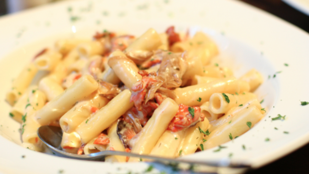

La ricetta che vi voglio proporre oggi riguarda la preparazione di un primo piatto a base di pesce, ideale da gustare freddo, magari in occasione della pausa pranzo al lavoro: sto parlando della Pasta fredda al salmone e yogurt greco.

Il manicaretto che andiamo a scoprire di seguito è davvero molto semplice e veloce da realizzare e vi permette in pochi minuti di realizzare qualcosa dal sapore delicato e dal profumo davvero intenso.
This would be the description of the recipe. Any info or history about the recipe goes here

Ingredients
===========

* 200gr pasta corta
* 70gr salmone fresco
* 100gr yogurt greco
* 1tsp aneto fresco
* aglio, uno spicchio
* sale, pepe, olio

Preparation
===========

Iniziamo la nostra ricetta partendo dalla cottura del pesce: all'interno di una pentola antiaderente abbastanza capiente mettete a dorare lo spicchio di aglio insieme ad un filo di olio extra vergine di oliva; non appena avrà iniziato a rosolare, aggiungete il salmone fresco e scottatelo da entrambi i lati in modo omogeneo, quindi aggiungete un po' di yogurt greco finché non si sarà ben cotto (in questo modo rimarrà molto morbido). Una volta pronto, sbriciolate il salmone a pezzettini.

Nel frattempo, in una casseruola a parte, mettete a lessare la pasta in abbondante acqua salata. Quando sarà arrivata la cottura al dente, togliete dal fuoco e scolate per bene. Versatela poi all'interno della padella insieme al pesce e condite con dell'aneto fresco ed un pizzico di sale e pepe. Spadellate bene il tutto, quindi aggiungete dell'altro yogurt greco, in modo da rendere il tutto ancora più cremoso.

Mettete a riposare in frigorifero per almeno un'oretta in modo che i sapori si rapprendano. Al momento della degustazione è meglio se la pasta sia a temperatura ambiente.

Notes
=====
