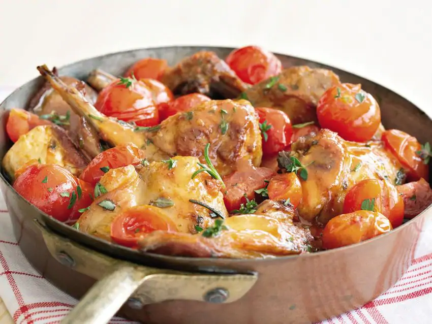

Il coniglio all'Ischitana è una ricetta prelibata della cucina napoletana tipica dell'isola d'Ischia, preparata soprattutto nei giorni di festa: succulenti e teneri pezzi di carne di coniglio, cucinati in padella con olio extravergine di oliva, pomodorini, aglio epeperoncino; profumati con basilico, timo e maggiorana. La ricetta di Sale&Pepe è tradizionale, semplice da preparare ma richiede tempi lunghi per marinare la carne e tempo per seguire le varie fasi di cottura della carne. Il risultato è strepitoso: un secondo piatto dai sapori mediterranei, difficile da dimenticare che certamente lascerà un piacevole ricordo ai tuoi commensali.

Ingredients
===========

* 1,2kg Coniglio
* 1 ciuffo Basilico 
* 1 spicchio Aglio 
* 1 rametti Timo 
* 1 rametti Maggiorana secca
* 1 bicchiere Vino Bianco
* 400gr Pomodorini Ciliegia
* 1 Peperoncino 
* q.b. Olio di Oliva Extravergine
* q.b. Aceto Bianco
* q.b. Sale

Preparation
===========

1) Marina la carne. Taglia a pezzi abbastanza regolari il coniglio, lavali e disponili in una terrina. Coprili con acqua e 1/2 bicchiere di aceto di vivo bianco; la carne deve essere perfettamente immersa nella marinata. Lasciali così per circa 60 minuti.

2) Nel frattempo, lava e asciuga i pomodorini ciliegia, taglia la metà a spicchi, poi strizzali in un colino facendo attenzione a recuperare il loro succo in una ciotola.

3) Trita finemente il basilico, il timo e la maggiorana. Versa in una padella antiaderente 1 bicchiere d’olio extravergine di oliva e scaldalo bene, quindi metti a soffriggere il peperoncino e l’aglio sbucciato. Appena l'aglio si sarà dorato eliminalo.

4) Rosola la carne. Sgocciola i pezzi di coniglio, asciugalo con della carta assorbente da cucina, poi mettine 2 o 3 pezzi alla volta nell’olio bollente; girali con un cucchiaio di legno per rosolarli bene su tutti i lati, poi trasferiscili in un piatto. Continua con l’operazione con gli altri pezzi fino a che non hai terminato la carne, riponendoli nello stesso piatto. 

5) Cuoci il coniglio. Dopo aver tolto un po’ dell’olio di cottura iniziale, rimetti nella pentola tutti i pezzi di coniglio rosolati, regola di sale e cuocili per qualche minuto mescolandoli. Alza la fiamma e versa, un po' alla volta, il vino bianco, lascialo evaporare, poi prosegui la cottura per 15-20 minuti.

6) Aggiungi i pomodori, sia interi che a spicchi, mescola e prosegui la cottura per altri 15 minuti, quando sono ammorbiditi schiacciali un poco aiutandoti con i rebbi di una forchetta. Regola di sale.

7) Aggiungi le erbe aromatiche che hai tritato, e prosegui la cottura ancora per 20- 30 minuti, fino a ottenere un sugo più o meno ristretto o della densità desiderata. Durante la cottura irrora di tanto in tanto il coniglio con un po' di acqua calda e con il liquido dei pomodori tenuto da parte.

8) Disponi il tuo coniglio all'ischitana in un piatto da portata e servilo subito.

Notes
=====
